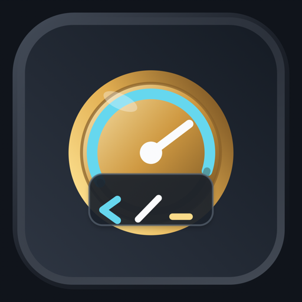

<div align="center">



# WhatTheToken — Downloads

**Know which AI coding tool you can still use — before it cuts you off.**

A local-first macOS menu bar app for Claude Code and Codex usage limits.

[**⬇︎ Download the latest DMG**](https://github.com/hansDraisma/whatthetoken-releases/releases/latest) · [Website](https://hansdraisma.github.io/whatthetoken-releases/) · [**Source code and documentation →**](https://github.com/hansDraisma/whatthetoken)

</div>

---

> **Looking for the code, the architecture, or a way to contribute?**
> This repository only hosts release artifacts. Everything else lives in
> **[hansDraisma/whatthetoken](https://github.com/hansDraisma/whatthetoken)**.

## Install

1. Download the DMG and its `.sha256` checksum from
   [the latest release](https://github.com/hansDraisma/whatthetoken-releases/releases/latest).
2. Verify the download:
   ```bash
   shasum -a 256 -c WhatTheToken-<version>.dmg.sha256
   ```
3. Open the DMG and drag **WhatTheToken** to Applications.
4. Launch it. macOS shows a Gatekeeper prompt the first time — choose Open.

The app appears in the menu bar and adds no Dock icon. Requires **macOS 14 or later**.
Both connectors start disconnected; connect them when you are ready.

## Updates

Updates are manual by design. `Check for Updates` is an explicit action — there are no
background checks and no silent installs. This repository hosts the update feed
(`appcast.xml`), and GitHub Releases is always a valid way to fetch the newest signed and
notarised DMG yourself.

## Privacy and support

- [Privacy policy](PRIVACY.md)
- Bugs → [Issues](https://github.com/hansDraisma/whatthetoken-releases/issues)
- Security reports → [SECURITY.md](SECURITY.md)
- Bundled components → [THIRD_PARTY_NOTICES.md](THIRD_PARTY_NOTICES.md)

> **Never include provider credentials, cookies, authorization headers, tokens, prompts,
> responses, or raw provider payloads in an issue.** If you are attaching output, read it
> first.

## Repository scope

This public repository contains customer-facing release artifacts, checksums, release
notes, update metadata, the download page, support templates, and legal notices. Private
signing material is never published here.

## License

Apache-2.0. Copyright 2026 Hans Draisma unless otherwise noted. See [LICENSE](LICENSE) and
[NOTICE](NOTICE).

WhatTheToken is an independent community project, not affiliated with, endorsed by, or
sponsored by Anthropic or OpenAI. "Claude", "Claude Code", and "Anthropic" are trademarks
of Anthropic, PBC; "Codex", "ChatGPT", and "OpenAI" are trademarks of OpenAI, Inc. Used for
identification only.
